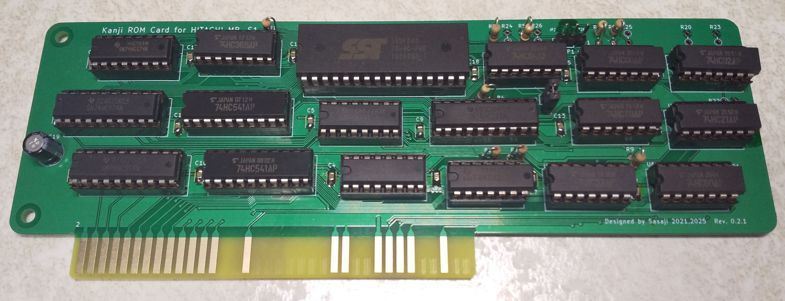
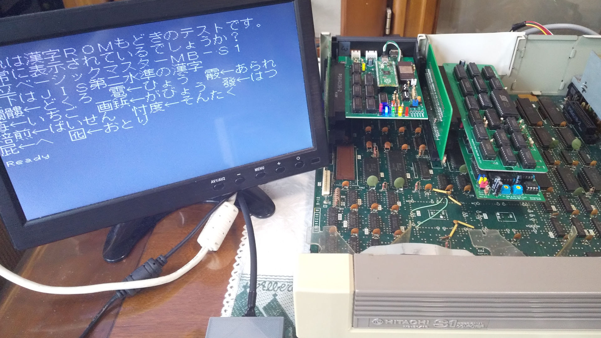

# JIS第二水準内蔵漢字ROMカード for 日立MB-S1

## フォルダ構成

    Board/ ......................... 基板設計
    Documents/ ..................... 説明書など

-----
# JIS Level 2 Kanji Insided Kanji ROM Card for HITACHI MB-S1

## Folders

    Board/ ......................... The circuit board design
    Documents/ ..................... User's Manual etc.

-----
 MailTo: Sasaji (sasaji@s-sasaji.ddo.jp)
 * My Webpage: http://s-sasaji.ddo.jp/bml3mk5/
 * GitHub:     https://github.com/bml3mk5/S1KanjiRomJIS2
 * X(Twitter): https://x.com/bml3mk5
